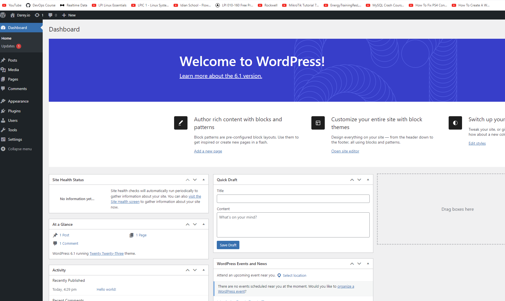

## WEB SOLUTION DEPLOYMENT WITH STORAGE VOLUME MANAGEMENT: WORDPRESS STEP BY STEP DEPLOYMENT GUIDE

## Step 1: Launch an EC2 instance that will serve as the web server and attach 3 different storage to the instance

## logon to the EC2 instance and use the command below to know if the volume or blocks have been attached to the EC2 instance

`lsblk`

## you can also inspect all devices in linux using the command below

`ls /dev/`

## the command below to see all mount and free space on the server

`df -h`

## check if blocks have a file system by running script below, else create one. file systems needs to be setup for xvdf, xvdg and xvdh

`file -s /dev/xvd..`

## create file system for each volume without a file system configured by using the command below

`mkfs -t ext4 /dev/xvdf`

## then create a storage folder for the volumes and mount the volumes to the directrory

## use the command below to create a partition for each of the added disc xvdf, xvdg and xvdh, videos can be reviewed on how to create a partition

`sudo gdisk /dev/xvdf`

## install lvm package using yum since its a RHEL distro. ensure the partitions are converted from Linux file system to Linux LVM using the commands below

`sudo gdisk /dev/xvdh`

`?`

## check the meaning of the different help options then type t to convert file system to linux LVM

## next step is to create the physical volume for the partitions using the command below. do this for each created disc. the picture below shouws how to create create an LVM volume

`sudo pvcreate /dev/xvdf`

## verify that the physical volumes have been created by running 

`sudo pvs`

## Now add all volumes to a volume group using the command below. Name the VG webdata-vg

`sudo vgcreate webdata-vg /dev/xvdh1 /dev/xvdg1 /dev/xvdf1`

## verify Volume group creation by  running the command below

`sudo vgs`

## use the command below to create two logical volumes (apps-lv and  logs-lv) from the volume group

`sudo lvcreate -n apps-lv -L 14G webdata-vg`

`sudo lvcreate -n logs-lv -L 14G webdata-vg`

## apps-lv will be used to store data for the Website while, logs-lv will be used to store data for logs.

## verify logical volume creation using the command below

`sudo lvs`

## entire setup can be verified using the command below

`sudo vgdisplay -v #view complete setup - VG, PV, and LV`

`sudo lsblk `

## use the command below to create a file system for the logical volume before it can be mounted to the folder

`mkfs.ext4`

`sudo mkfs -t ext4 /dev/webdata-vg/apps-lv`

`sudo mkfs -t ext4 /dev/webdata-vg/logs-lv`

## create a directroy to store the website files and another to store the logfiles using the command below

`sudo mkdir -p /var/www/html`

`sudo mkdir -p /home/recovery/logs`

## mount the volume to the directory using the commands below

`sudo mount /dev/webdata-vg/apps-lv /var/www/html/`

## Use rsync utility to backup all the files in the log directory /var/log into /home/recovery/logs (This is required before mounting the file system). using the command below

`sudo rsync -av /var/log/. /home/recovery/logs/`

## then mount the logs logical volume to its own directory as well

## restore log files back into /var/log directory

`sudo rsync -av /home/recovery/logs/. /var/log`

## update the /etc/fstab/ so that the mount persist after server restart. this is a must do

## the UUID of the device will be used to update the device in the fstab

`: UUID=df88a1d3-2df2-4504-98a6-cd42181260ed`

` UUID=6d503266-4d9e-44a2-ba49-7ff274480e1b`

## run the command below to ensure the setup is okay

`sudo mount -a`

## run sudo yum update for both EC2 instances. this takes a while to update on the Red Hat Distro

## with that process the the mount point will still exist after server restart

## do same process for the DB server as well by creating addition disc, and adding them to a Logical volume to be used to acrry out other activities.

## install wordpress on the webserver using the command below steps below

## install wget, apache with other dependencies using the command below

`sudo yum -y install wget httpd php php-mysqlnd php-fpm php-json`

## start Apache

## install php and its dependencies

`sudo yum install https://dl.fedoraproject.org/pub/epel/epel-release-latest-8.noarch.rpm`

`sudo yum install yum-utils http://rpms.remirepo.net/enterprise/remi-release-8.rpm`

`sudo yum module list php`

`sudo yum module reset php`

`sudo yum module enable php:remi-7.4`

`sudo yum install php php-opcache php-gd php-curl php-mysqlnd`

`sudo systemctl start php-fpm`

`sudo systemctl enable php-fpm`

## to allow Linux run php packages for Redhat and centos- run the command below

`sudo setsebool -P httpd_execmem 1`

## Download wordpress and copy wordpress to var/www/html using the commands below

 `mkdir wordpress`

  `cd   wordpress`

  `sudo wget http://wordpress.org/latest.tar.gz`

  `sudo tar xzvf latest.tar.gz`

  `sudo rm -rf latest.tar.gz`

  `sudo cp wordpress/wp-config-sample.php wordpress/wp-config.php`

  `sudo cp -R wordpress /var/www/html/`

  ## configure SELinux policy using the commands below

  `sudo chown -R apache:apache /var/www/html/`

  `sudo chcon -t httpd_sys_rw_content_t /var/www/html/wordpress -R`

  `sudo setsebool -P httpd_can_network_connect=1`

  `sudo setsebool -P httpd_can_network_connect_db 1`

  ## update the security policy to ensure you can access the redhat Enterprise page from the browser

  

 

  

  ## Install MySQL on your DB Server EC2 using the command below

  `sudo yum update`

`sudo yum install mysql-server`

## ensure the service is running as well

## user the scripts below to logon to mysql and create necessary tables and grant necessary permission

`sudo mysql`

`CREATE DATABASE wordpress;`

`CREATE USER `myuser@<Web-Server-Private-IP-Address>IDENTIFIED BY 'mypass';`

`GRANT ALL ON wordpress.* TO`

`'myuser'@'<Web-Server-Private-IP-Address>';`

`FLUSH PRIVILEGES;`

`SHOW DATABASES;`
`exit`

## try to edit the file below to enable redhat allow connection to the installed mysql-server on the host machine

`vi /etc/my.cnf.d`

## ensure to restart the mysqld service after updating the file

## update the wordpress config file as well in the var/www/html folder - 

`vi wp-config.php`

## move the default apache folder as well to another folder to enable the new file to be accessed

`mv /etc/httpd/conf.d/welcome.conf /etc/httpd/conf.d/welcome.conf_backup`

## Configure WordPress to connect to remote database.

## Do not forget to open MySQL port 3306 on DB Server EC2

## install Mysql client on the App server using the commands below

## Try to use the password and username name to see if you can connect to the Mysql server from the app server

 ## try again to access the website using the public IP of the app server

  

  ## Congratulations

  

  

